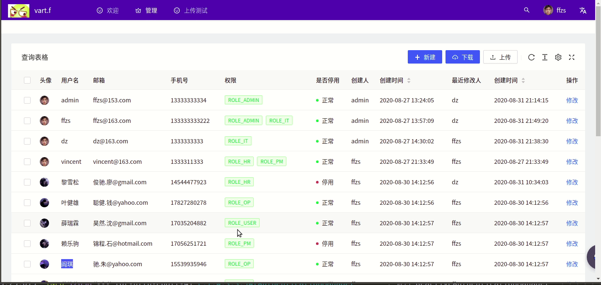

# Spring WebFlux + React搭建后台管理系统（8）:通过access鉴权


不得不说umi这个access功能还是比较实用的，现在鉴权的逻辑写起来要方便的多。我们可以通过access轻松实现很多功能：

+ 通过不同权限展示不同的菜单
+ 在组建中展示不同的内容
+ 对写入功能进行限制

做一个简单的实践，下面是三个用户不同权限，以及不同权限能达到的目的：

|  用户   | 权限  |                             功能                             |
| :-----: | :---: | :----------------------------------------------------------: |
|  ffzs   | admin | 可以查看所有内容包括权限，修改人等，以及添加用户，修改用户，删除用户 |
|   dz    |  it   |          可以看到部分用户信息，可以修改用户部分信息          |
| vincent |  hr   |                只能查看用户部分信息，不可修改                |

## 1. 权限设置

+ 在access.ts文件中设定
+ 通过比对权限列表来确定是否有权限
+ 读权限收有人都有，it有修改权限，admin有所有权限

```js
const isIn = (list1:Array<string>, list2:Array<string>) => {
  return list1.filter(item => {return list2.includes(item)}).length !== 0;
};

export default function access(initialState: { currentUser?: API.CurrentUser | undefined }) {
  const { currentUser } = initialState || {};
  const accessAdmin = ['ROLE_ADMIN'];
  const accessRead = ['ROLE_ADMIN', 'ROLE_HR', 'ROLE_IT'];
  const accessUpload = ['ROLE_ADMIN', 'ROLE_IT'];
  return {
    canAdmin: currentUser && isIn(accessAdmin, currentUser.access),
    canRead: currentUser && isIn(accessRead, currentUser.access),
    canUpload: currentUser && isIn(accessUpload, currentUser.access),
  };
}
```

## 2. 表格显示

+ 通过将表格拆分，不同权限获取内容不同

```java
const columns: ProColumns<UserDetails>[] = [
  {
    title: '头像',
    dataIndex: 'avatar',
    hideInForm: true,
    valueType: 'avatar',
  },
  {
    title: '用户名',
    dataIndex: 'username',
  },
  {
    title: '邮箱',
    dataIndex: 'email',
    valueType: 'textarea',
  },
  {
    title: '手机号',
    dataIndex: 'mobile',
  },
];
const adminColumns: ProColumns<UserDetails>[] = [
  {
    title: '权限',
    dataIndex: 'roles',
    renderText: (roles: Array<string>) => (
      <>
        {
          roles.map(role=>(
            <Tag color="green">
              {role}
            </Tag>
          ))
        }
      </>
    ),
  },
  {
    title: '是否停用',
    dataIndex: 'frozen',
    hideInForm: true,
    valueEnum: {
      0: { text: '正常', status: 'Success' },
      1: { text: '停用', status: 'Error' },
    },
  },
  {
    title: '创建人',
    dataIndex: 'createBy',
    hideInForm: true,
  },
  {
    title: '创建时间',
    dataIndex: 'createTime',
    sorter: true,
    valueType: 'dateTime',
    hideInForm: true,
  },
  {
    title: '最近修改人',
    dataIndex: 'lastUpdateBy',
    hideInForm: true,
  },
  {
    title: '创建时间',
    dataIndex: 'lastUpdateTime',
    sorter: true,
    valueType: 'dateTime',
    hideInForm: true,
  },
];
const updateColumns: ProColumns<UserDetails>[] = [
  {
    title: '操作',
    dataIndex: 'option',
    valueType: 'option',
    render: (_, record) => (
      <>
        <a
          onClick={() => {
            handleUpdateModalVisible(true);
            setStepFormValues(record);
          }}
        >
          修改
        </a>
      </>
    ),
  },
];
if (access.canAdmin) {
  columns.push(...adminColumns, ...updateColumns);
}
else if (access.canUpload) {
  columns.push(...updateColumns);
}
```

## 3. 按钮显示

+ 根据权限判断进行显示

```java
{access.canAdmin&&(<Button
  onClick={async () => {
    await handleRemove(selectedRowsState);
    setSelectedRows([]);
    // @ts-ignore
    actionRef.current?.reloadAndRest();
  }}
>
  批量删除
</Button>)}
```

## 4. 效果展示

### 4.1 admin权限

+ 可见可以访问权限，设置是否停用，可以看到创建时间等
+ 而且可以新增用户，修改，下载等


### 4.2 it权限

+ 跟admin相比，可以看到的数据少了，只有修改权限，而且可修改内容也变少了


### 4.3 hr权限

+ hr只能查看用户的部分信息，不能修改


当然还有其他一些角色无法访问该页面



## 5.代码

| github | [前端（antd pro）](https://github.com/ffzs/System_app_antdpro_fore-end) | [后端（spring webflux）](https://github.com/ffzs/System_app_webflux_react) |
| ------ | ------------------------------------------------------------ | ------------------------------------------------------------ |
| gitee  | [前端（antd pro）](https://gitee.com/ffzs/System_app_antdpro_fore-end) | [后端（spring webflux）](https://gitee.com/ffzs/System_app_webflux_react) |