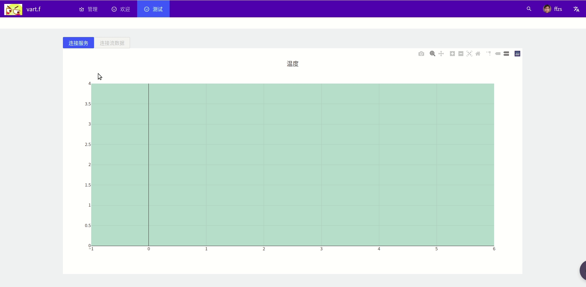

# Spring WebFlux + React搭建后台管理系统（11）:尝试RSocket数据流传输

reactor等响应式可以轻松的传递流数据，想起了spring的webflux也支持以rsocket，它可以通过websocket或是tcp的方式进行数据传输，正好有java版本和js版本，且spring也支持rsocket，下面尝试是哟给你rsocket模拟天气数据的传输，前端接到数据通过折线图展示。


## 1. 后端部分

### 1.1 model实现

+ 创建一个weather类用于传输包装数据
+ 包含时间、风速、风向、温度数据

```java
/**
 * @author: ffzs
 * @Date: 2020/9/2 下午5:12
 */
@Data
@Builder
@AllArgsConstructor
@NoArgsConstructor
public class Weather {
    Long id;
    LocalDateTime date;
    Long direction;
    Long speed;
    Long temperature;
}
```

### 1.2 服务实现

+ 使用random获取一些数据用于测试
+ rsocket的controller使用的是`@Controller`
+ 路由是一段字符串`@MessageMapping("weather")`

```java
/**
 * @author: ffzs
 * @Date: 2020/9/2 下午4:35
 */

@Controller
@Slf4j
public class RSocketController {
    private final Faker f = new Faker(Locale.CHINA);


    @MessageMapping("weather")
    public Flux<Weather> stream(final String request) {

        return Flux
                .interval(Duration.ofSeconds(1))
                .filter(it -> it%10!=3)
                .map(index -> Weather.builder()
                        .id(index)
                        .date(LocalDateTime.now().minusDays(1000-index))
                        .direction(f.random().nextLong(360))
                        .speed(f.random().nextLong(150))
                        .temperature(f.random().nextLong(15)+20)
                        .build()
                )
                .log();
    }
}
```

### 1.3 rsocket配置

+ 需要配置传输方式`websocket`或是`tcp`
+ 配置port，不要跟web相同

```java
rsocket:
  server:
    transport: websocket
    port: 8081
```

+ 注入`ServerRSocketFactoryProcessor`

```java
@Configuration
public class RSocketConfig {

    @Bean
    ServerRSocketFactoryProcessor serverRSocketFactoryProcessor() {
        return RSocketFactory.ServerRSocketFactory::resume;
    }
}
```

## 2. 前端部分

### 2.1 实现client类

+ 实现rsocket的js部分完成rsocket的连接类
+ resumeToken要设置一下，两个连接使用同一个resumeToken，前一个会被顶掉，这里设置这个参数也是方便登录鉴权
+ metadata中会存放route的东西，就是spring中的 `@MessageMapping("weather")`，这里用这个设置`${String.fromCharCode(route.length)}${route}`

```javascript
import {IdentitySerializer, JsonSerializer, RSocketClient, RSocketResumableTransport} from "rsocket-core";
import {message} from "antd";
import RSocketWebSocketClient from "rsocket-websocket-client";
import {v4} from 'uuid';
import {Weather} from "./Weather";

export class Client {

  constructor(address) {
    this.client = new RSocketClient({
      serializers: {
        data: JsonSerializer,
        metadata: IdentitySerializer
      },
      setup: {
        keepAlive: 10000,
        lifetime: 20000,
        dataMimeType: 'application/json',
        metadataMimeType: 'message/x.rsocket.routing.v0',
      },
      transport: new RSocketResumableTransport(
        () => new RSocketWebSocketClient({url: address}),
        {
          bufferSize: 200,
          // 这里类似token，session的东西，用于区分用户，鉴权，同一个resumeToken只能有一个获取数据
          resumeToken: v4('ffzs'),
        })
    });
  }

  connect() {
    return new Promise((resolve, reject) => {
      this.client.connect().subscribe({
        onComplete: s => {
          this.socket = s;
          this.socket.connectionStatus().subscribe(status => {
            message.info(`链接状态: ${JSON.stringify(status)}`)
          });

          resolve(this.socket);
        },
        onError: error => {
          reject(error);
        },
        onSubscribe: cancel => {
          this.cancel = cancel
        }
      });
    });
  }

  requestResponse(message, route) {
    return new Promise((resolve, reject) => {
      this.socket.requestResponse({
        data: message,
        metadata: String.fromCharCode(route.length) + route
      }).subscribe({
        onComplete: msg => {
          resolve(new Weather().toObject(msg.data))
        },
        onError: error => {
          reject(error)
        }
      });
    });
  }

  fireAndForget(message, route) {
    return this.socket.fireAndForget({
      data: message,
      metadata: `${String.fromCharCode(route.length)}${route}`
    });
  }

  requestStream(message, route) {
    return this.socket.requestStream({
      data: message,
      metadata: `${String.fromCharCode(route.length)}${route}`
    });
  }

  requestChannel(flow, route) {
    return this.socket.requestChannel(flow.map(msg => {
      return {
        data: msg,
        metadata: `${String.fromCharCode(route.length)}${route}`
      };
    }));
  }

  disconnect() {
    console.log('rsocketclientsocket', this.socket);
    console.log('rsocketclient', this.client);
    this.client.close();
  }
}
```

### 2.2 连接实现

+ 通过按钮激活连接

```javascript
handleConnect() {
  if (!this.state.connected) {
    this.client = new Client(this.state.address);
    this.client.connect().then(() => {
      this.setState({connected: true});
    });
    // message.success(`成功连接`)
  } else {
    this.client.disconnect();
    this.setState({connected: false});
  }
}
```

### 2.3 访问实现

+ 这里通过`requestCount`实现背压
+ onNext中获取每回返回数据

```javascript
handleRequestStream() {
  if (!this.state.inStream) {
    const requestCount = 5;
    let processedCount = 0;
    const msg = new Weather('client', 'request');

    this.client.requestStream(msg, 'weather').subscribe({
      onSubscribe: sub => {
        this.streamSub = sub;
        this.streamSub.request(requestCount);
        this.setState({inStream: true});
      },
      onError: error => {
        message.error(`出现错误 ${error}`)
      },
      onNext: msg => {
        this.addData(msg.data);
        processedCount += 1;

        if (processedCount >= requestCount) {
          this.streamSub.request(requestCount);
          processedCount = 0;
        }

      },
      onComplete: () => {
      },
    });
  } else {
    this.streamSub.cancel();
    this.setState({inStream: false});
  }
}
```

### 2.4 作图

使用plotly简单绘图，可视化数据,添加依赖：

```bash
npm install react-plotly.js plotly.js

```
+ 接入数据
+ x轴时间，y轴温度
+ 设置y轴由0开始

```javascript
<Plot
  data={[
    {
      x: this.state.date,
      y: this.state.temperature,
      type: 'scatter',
      mode: 'lines',
      marker: {color: 'rgba(197,84,118,0.71)'},
    },
  ]}
  layout={{width: 1300,
    height: 640,
    title: '温度',
    plot_bgcolor:"rgba(65,135,113,0.35)",
    yaxis: {
      rangemode:"tozero",
    }
  }}
/>
```

### 2.5 设置button

+ 服务连接前无法连接数据流
+ 连接数据流之后无法直接关闭服务

## 3. 结果展示




## 4.源码

| github | [前端（antd pro）](https://github.com/ffzs/System_app_antdpro_fore-end) | [后端（spring webflux）](https://github.com/ffzs/System_app_webflux_react) |
| ------ | ------------------------------------------------------------ | ------------------------------------------------------------ |
| gitee  | [前端（antd pro）](https://gitee.com/ffzs/System_app_antdpro_fore-end) | [后端（spring webflux）](https://gitee.com/ffzs/System_app_webflux_react) |

