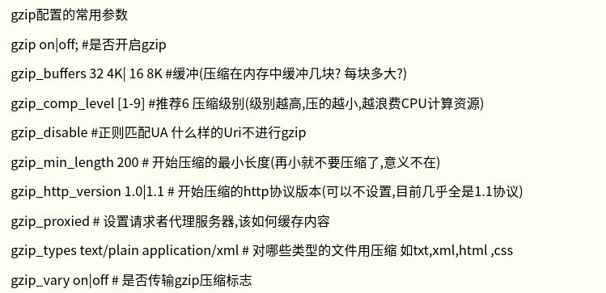
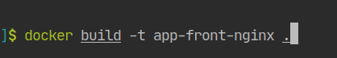
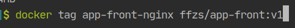
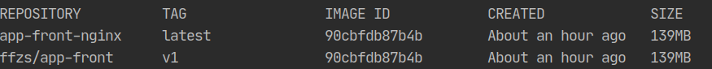
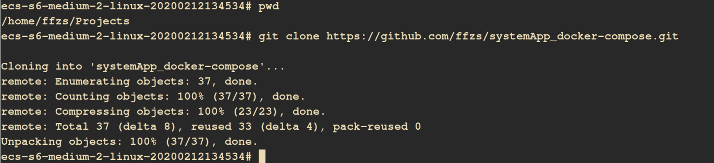
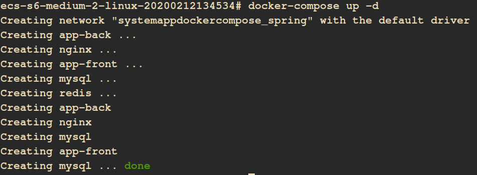
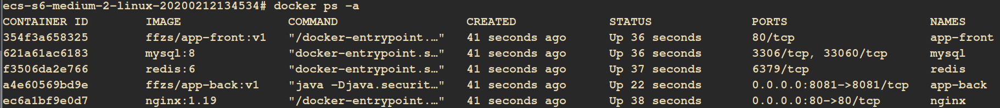
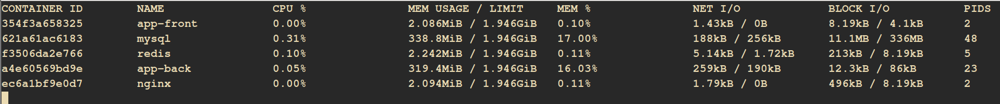
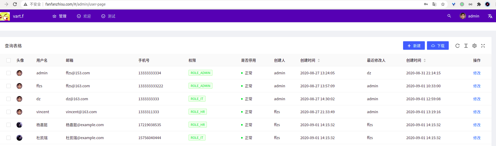

# Spring WebFlux + React搭建后台管理系统（14）:项目前端docker image并实现云端部署

前端的image制作流程其实跟后端的也没啥区别，首先通过build生成静态文件，也就是dist文件夹中的文件，然后通过放到nginx的image中，配置nginx的配置文件，进行包装即可。

## 1. Dockerfile

+ 这里dist文件夹，是项目build之后生成的静态文件，一般是`npm build`
+ EXPOSE 指令是声明运行时容器提供服务端口，这只是一个声明。在 Dockerfile 中写入这样的声明有两个好处，一个是帮助镜像使用者理解这个镜像服务的守护端口，以方便配置映射；另一个用处则是在运行时使用随机端口映射时，也就是 docker run -P时，会自动随机映射 EXPOSE 的端口。
+ WORKDIR 用来指定工作目录

```dockerfile
FROM nginx:1.19

WORKDIR /usr/share/nginx/html/
COPY ./nginx.conf /etc/nginx/conf.d/default.conf
COPY ./dist  /usr/share/nginx/html/
EXPOSE 80
CMD ["nginx", "-g", "daemon off;"]
```

## 2. 创建nginx.conf

+ antd pro 官网找到
+ gzip用于压缩缓存，相传可以提高网站速度，计算资源充足的情况下可以使用



+ 通过root设置工作目录

```json
server {
    listen 80;

    gzip on;
    gzip_min_length 1k;
    gzip_comp_level 9;
    gzip_types text/plain text/css text/javascript application/json application/javascript application/x-javascript application/xml;
    gzip_vary on;
    gzip_disable "MSIE [1-6]\.";

    root /usr/share/nginx/html;

    location / {
        try_files $uri $uri/ /index.html;
    }
}
```

## 3. 生成docker image

在项目目录运行，生成一个命名为app-front-nginx的镜像。



通过tag将其弄成适配自己docker hub 仓库的形式：



处理之后的容器：



## 4. 上传docker hub

上传方法可以参考之前文章：

[搞机：本地 docker 镜像上传到 docker hub](https://blog.csdn.net/tonydz0523/article/details/106686919)

## 5. 制作docker-compose启动文件

+ 后端使用到了mysql和redis
+ 通过nginx反向代理前段和后端服务， 这里需要配置一下nginx
+ 后端的RSocker服务不走http，因此nginx没法反向代理，因此要暴露端口

```yml
version: '3'
services:
    redis:
        image: redis:6
        container_name: redis
        restart: always
        networks:
            - spring
        volumes:
            - ./redis/conf/redis.conf:/usr/local/etc/redis/redis.conf
            - ./redis/db/:/data/           
        command: redis-server /usr/local/etc/redis/redis.conf

    mysql:
        image: mysql:8
        container_name: mysql
        networks:
            - spring
        restart: always
        volumes:
            - ./mysql/db:/var/lib/mysql
            - ./mysql/conf.d:/etc/mysql/conf.d
        environment:
            - MYSQL_ROOT_PASSWORD=123zxc    
        command: --default-authentication-plugin=mysql_native_password

    app-back:
        image: ffzs/app-back:v1
        container_name: app-back
        restart: always
        networks:
            - spring
        ports:
            - 8081:8081

    nginx:
        image: nginx:1.19
        container_name: nginx
        restart: always
        networks:
            - spring
        ports:
            - 80:80
        volumes:
            - ./nginx/nginx.conf:/etc/nginx/nginx.conf

    app-front:
        image: ffzs/app-front:v1
        container_name: app-front
        restart: always
        networks:
            - spring

networks:
    spring:
```

## 6.代理配置nginx配置如下：

+ api路径对应后端数据
+ `/` 对应前端服务

```json
http {
  keepalive_timeout 65;
  server {
    listen 80;
    gzip on;
    gzip_min_length 1k;
    gzip_comp_level 9;
    gzip_types text/plain text/css text/javascript application/json application/javascript application/x-javascript application/xml;
    gzip_vary on;
    gzip_disable "MSIE [1-6]\.";

    location / {
      proxy_pass http://app-front:80;
    }

    location /api{
      proxy_pass http://app-back:8080/api;
    }
  }
  include /etc/ngnix/conf.d/*.conf;
}
events { worker_connections 1024; }

```

## 7. 运行文件及配置上传github

将配置文件和用于启动的docker-compose.yml文件上传到github上：

https://github.com/ffzs/systemApp_docker-compose.git


## 8. 登录云主机

我用的是比较低配的，1核2G内存。

登录主机创建一个文件夹然后将github上的项目clone下来：

```bash
git clone https://github.com/ffzs/systemApp_docker-compose.git
```




+ 进入目录，然后运行docker-compose

```bash
docker-compose up -d
```

+ docker-compose安装可以看这个 [搞机:使用docker-compose10分钟搞定redis,mongodb,mysql三大数据库](https://blog.csdn.net/tonydz0523/article/details/104332332)



+ 通过`docker ps`查看启动情况
+ 通过`docker logs 容器名`可以查看日志



+ `docker stats`可以查看各个容器使用资源情况



## 9. 效果

项目部署在了http://fanfanzhisu.com/，感兴趣可以去看看，不过现在第一次登录不跳转，具体问题还没有排查

