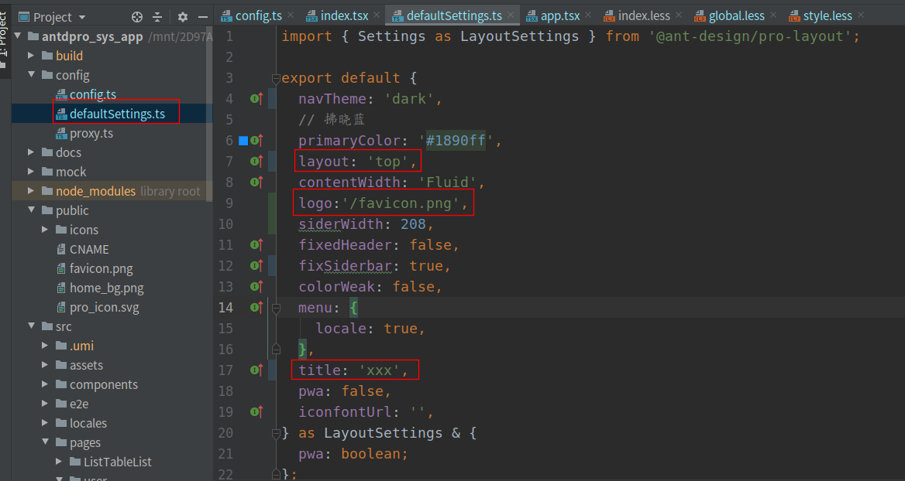
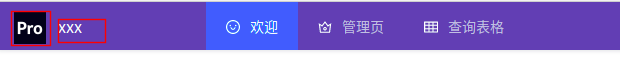
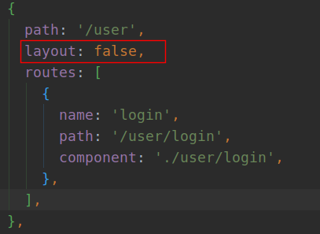
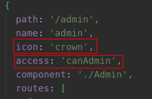
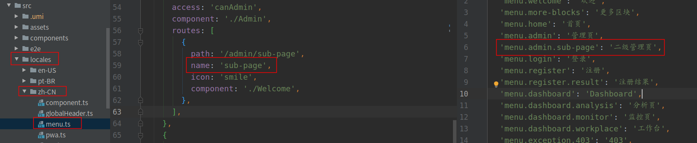
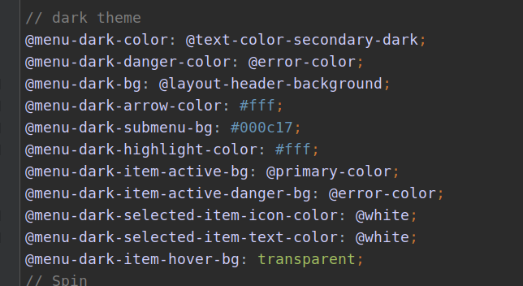
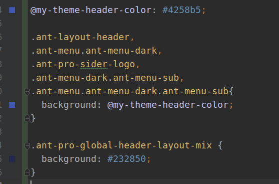
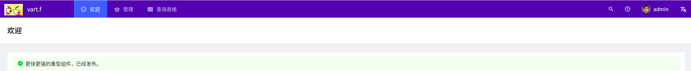
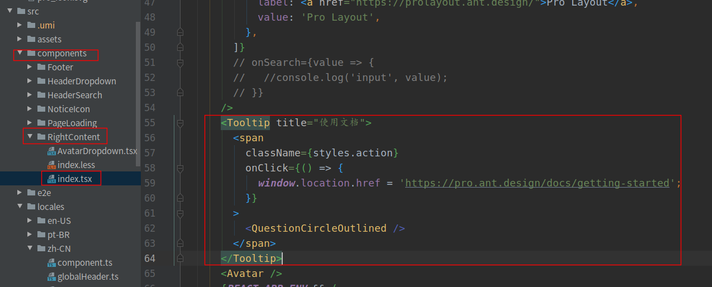
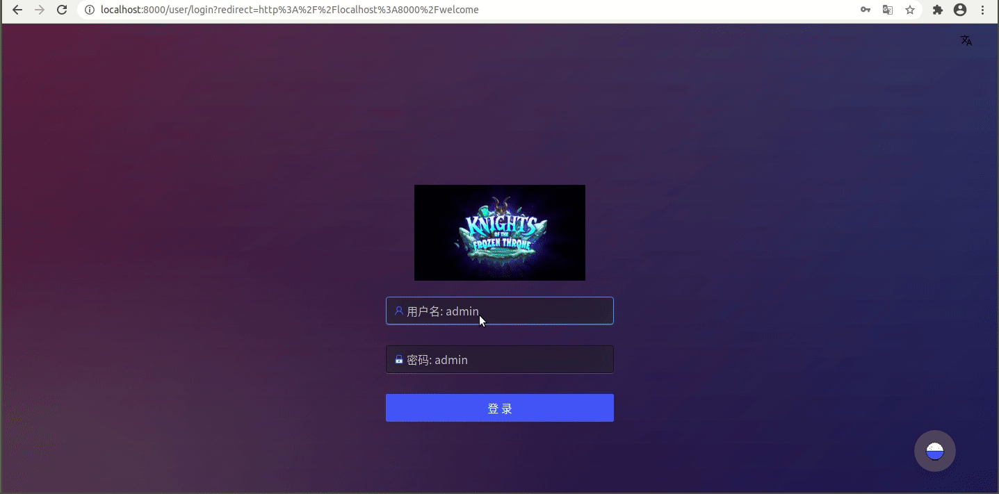

# Spring WebFlux + React搭建后台管理系统（4）: antd pro v5 设置

本篇使用l研究一下ayout中的一些设置，以及locale使用，更改标题，添加logo，更改样式样式功能。

[点我进入官方教程](https://procomponents.ant.design/docs/getting-started-layout#pagecontainer)

内容分为一下几点：

+ 更改标题
+ 更改logo
+ route配置locale
+ 修改样式
+ 设置footer
+ 修改rightContent
+ 美化登录页面

## 1. 更改标题，logo

+ 通过config文件夹的defaultSetting文件进行layout设置的更改，也可以在config.ts文件中更改，config中的修改会覆盖setting中内容



+ title指的就是logo旁边的名称，下图中xxx
+ logo指的是图标，下图中Pro图标，可以通过指定本地文件，Public文件夹中文件，也可以是一个图片的url



+ layout是menu样式，一共三种top|side|mix，top就是都在上面，没有侧边栏
+ navTheme：menu的主题风格，dark和light两种类型

## 2. 配置routes

配置routes通过config文件夹中的config.ts文件进行配置

+ layout改为false的情况下就不显示menu等，因为login界面是全屏需要去掉layout
+ route中的routes为下级页面，component为该也使用的组建，默认为地址下的index.ts文件



+ icon使用的antd上的icon，直接写名称默认使用
+ access用来配置权限，在根目录的access.ts中进行配置



+ 通过route中的name在locales文件夹中的menu.ts文件中进行内容配置



+ 通过设置`hideInBreadcrumb`为true不显示页面的面包屑

## 3. 修改主题

项目提供了两个颜色的主题，想要换一下颜色，找了半天文档没有找到实现方法，如果真的想换的话，我暂时发现两个方法：

+ 通过更改源码中的`node_modules/antd/es/style/themes/default.less`文件中的颜色
+ 找到dark theme那些，进行修改就行，记得修改的时候保存一下



+ 在一个就是更改根目录下的`global.less`文件来修改样式，不过这个方法用起来很不方便



+ 通过global.less修改很容易漏掉一些内容
+ 对menu进行了背景颜色的修改



## 4. 设置footer

app.ts文件中layout中有一个`footerRender`项可以用来动态设置footer：

```js
footerRender: () => {
  if (history.location.pathname === '/user/login') {
    return <footer />
  }
  return <Footer />
},
```

在login页面不显示footer

## 5. 设置PageContainer

+ 通过设置title为`false`不显示menu的标题


## 6. 配置rightContent

一开始我一直想知道啥是rightContent，后来发现就是右上角那些功能：


+ 由于我们不需要文档使用图标找到相应的模块删除即可



+ 通过配置`Avatar`添加menu激活`dropdown`，或者直接重写也可

## 7. 美化登录页面

通过使用修改background以及表单的input的一些css对登录页面进行美化，感觉还是不咋好看:crying_cat_face:

## 8. 演示

+ 登录页面优化
+ 更换了title和logo
+ 去掉了面包屑和menu名称
+ 点击头像出现下拉
+ ffzs登录有ADMIN权限，dz登录没有ADMIN权限，所以没有出现管理页面



## 9. 代码

[github](https://github.com/ffzs/System_app_antdpro_fore-end)
[gitee](https://gitee.com/ffzs/System_app_antdpro_fore-end)