# Spring WebFlux + React搭建后台管理系统（3）: antd pro v5实现登入登出

antdpro是蚂蚁金服开发的后台管理框架模板，继承了许多组建，可以满足快速开发，组建使用的antd，组建种类比较多，功能比较全，设计也挺好看的，但是封装程度有点高，用起来可能不是很灵活，一些功能需要研究一下。

## 1. 创建antd项目

+ [官方创建项目说明](https://beta-pro.ant.design/docs/getting-started-cn)

### 1.1 命令行键入：

```bash
yarn create umi
```

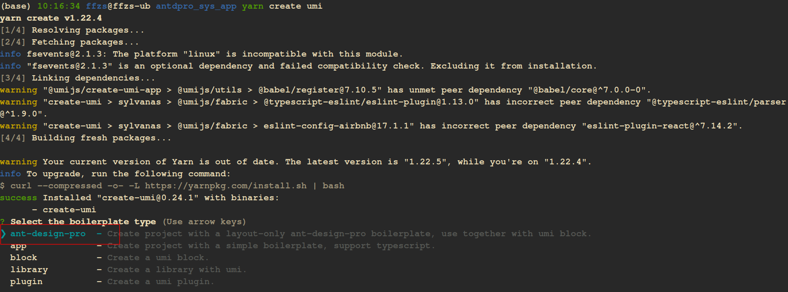

### 1.2 选择Pro v5：

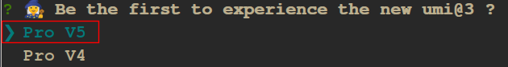

这时项目文件全部拉下来了：

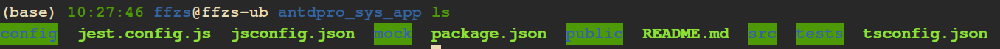

### 1.3 下载依赖

+ 通过yarn下载，时间会比较长

```bash
yarn
```

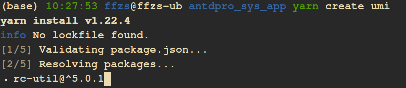

### 1.4 运行项目

通过键入`yarn start`启动项目

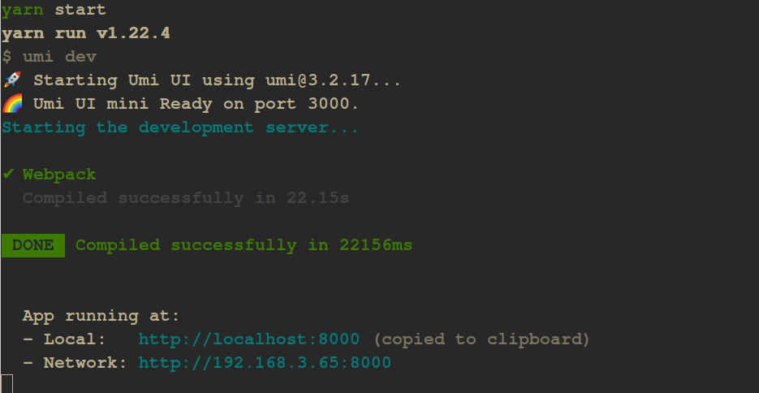

通过浏览器访问，不要用ie，可见项目界面：

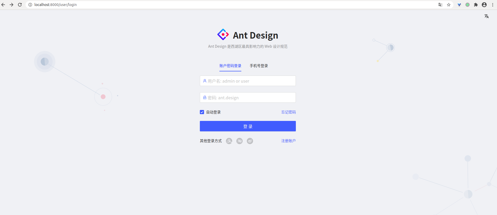

## 2. 登入实现

由于使用`initialState`， v5的login和v4的login的一些文件功能位置发生了变化，之前用的dva，现在也没了。

### 2.1 修改login的页面

+ 找到login的页面以及功能页面

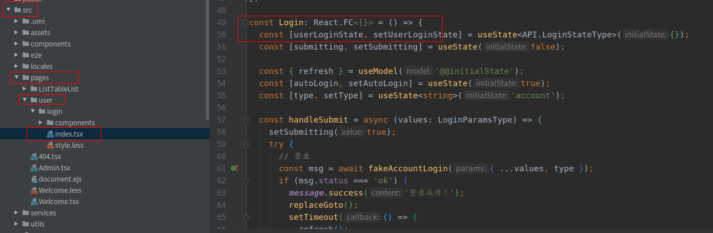

+ 登录页面修改：只需要用户密码登录

```js
const Login: React.FC<{}> = () => {
  const [userLoginState, setUserLoginState] = useState<API.LoginStateType>({});
  const [submitting, setSubmitting] = useState(false);

  const { refresh} = useModel('@@initialState');

  const handleSubmit = async (values: LoginParamsType) => {
    setSubmitting(true);
    try {
      // 登录
      const msg = await accountLogin({ ...values,  type: 'account'});

      if (msg.status === 200) {
        message.success('登录成功！');

        localStorage.setItem("token", msg.data.token);
        localStorage.setItem("user", JSON.stringify(msg.data));
        replaceGoto();
        setTimeout(() => {
          refresh();
        }, 0);
        return;
      }
      // 如果失败去设置用户错误信息
      setUserLoginState({status: msg.status, type: 'account'});
    } catch (error) {
      message.error('登录失败，请重试！');
    }
    setSubmitting(false);
  };

  const { status, type: loginType } = userLoginState;

  return (
    <div className={styles.container}>
      <div className={styles.lang}>
        <SelectLang />
      </div>
      <div className={styles.content}>
        <div className={styles.blank}> </div>
        <div className={styles.main}>
          
          <LoginFrom onSubmit={handleSubmit}>
            <div key="account">
              {status === 'error' && loginType === 'account' && !submitting && (
                <LoginMessage content="账户或密码错误（admin/ant.design）" />
              )}

              <Username
                name="username"
                placeholder="用户名: admin"
                rules={[
                  {
                    required: true,
                    message: '请输入用户名!',
                  },
                ]}
              />
              <Password
                name="password"
                placeholder="密码: admin"
                rules={[
                  {
                    required: true,
                    message: '请输入密码！',
                  },
                ]}
              />
            </div>
            <Submit loading={submitting}>登录</Submit>
          </LoginFrom>
        </div>
      </div>
      <Footer />
    </div>
  );
};
```

+ 通过`accountLogin` 方法登录获得token，以及用户信息
+ 将token和用户信息放到`localStorage`中
+ 跳转到之前页面或者 `/`页面
+ 刷新刷新`initialState`，更新登录信息

### 2.2 添加login访问api服务

+ 使用umi的request方法进行访问
+ 注意文件位置
+ 接口实现可以看一下之前系列文章

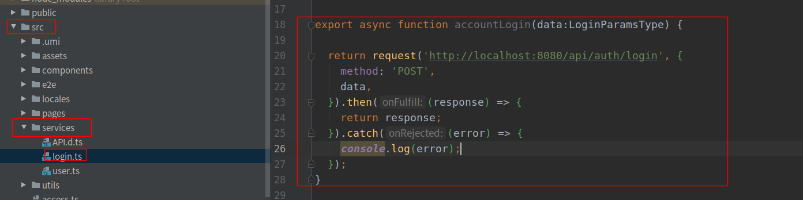

### 2.3 修改getInitialState方法

由于登录，鉴权都要使用`getInitialState`，默认方法`CurrentUser`中存放的是一个默认人的信息，需要变更为登录访问返回的个人信息：

+ 该方法存在根目录的`app.tsx`中，修改如下：
+ 为了配合`CurrentUser`使用可以把api传过来的字段名改一下
+ 获取登入存储在`localStorage`中的user写入`currentUser`中

```js
export async function getInitialState(): Promise<{
  currentUser?: API.CurrentUser;
  settings?: LayoutSettings;
}> {
  // 如果是登录页面，不执行
  if (history.location.pathname !== '/user/login') {
    try {
      const currentUser:API.CurrentUser = JSON.parse(localStorage.getItem('user')||'');
      currentUser.access = currentUser.roles;
      return {
        currentUser,
        settings: defaultSettings,
      };
    } catch (error) {
      history.push('/user/login');
    }
  }
  return {
    settings: defaultSettings,
  };
}
```

### 2.4 修改CurrentUser

为了配合使用，将原来的`currentuser`添加或修改了一些字段

+ 添加mobile
+ 添加token
+ 添加roles
+ 修改access类型为array，目前roles中和access中内容一样，之后有可能通过map获取access

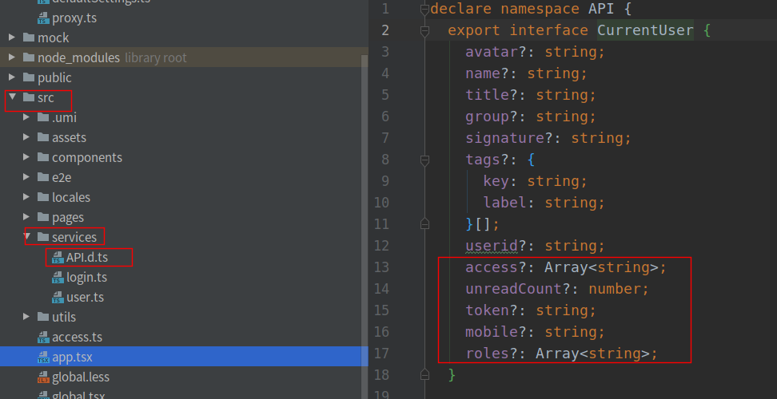

### 2.5 修改鉴权功能

新版本鉴权通过`access.ts`文件完成鉴权逻辑

+ 修改access方法
+ 由于access已经让我改成列表，判断逻辑需要修改

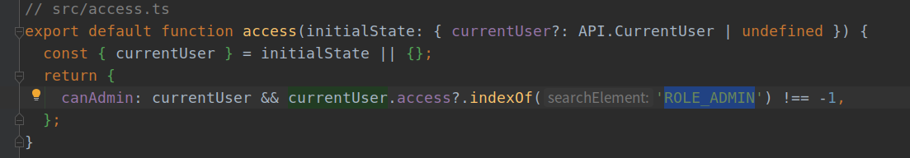

到这里登录的过程就基本完成了。

## 3.登出实现：

登出的实现比较简单，下图为登出方法所在位置

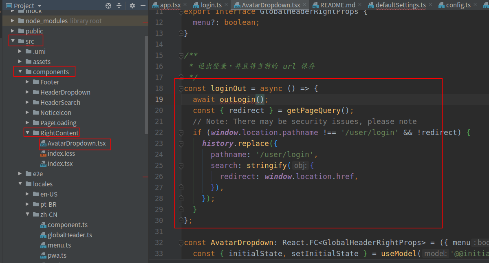

修改`loginout`方法如下：

+ 通过api将redis中token删除
+ 删除掉`localStorage`中的`token`和`user`，这样getInitialState无法获取`CurrentUser`自然无法访问其他页面

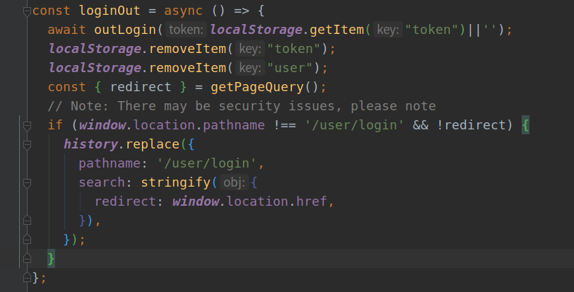

+ outLogin方法修改

```js
export async function outLogin(token: string) {
  return request('http://localhost:8080/api/auth/logout', {
    method: 'GET',
    params: {token},
  }).then((response) => {
    return response;
  }).catch((error) => {
    console.log(error);
  });
}
```

## 4. 测试

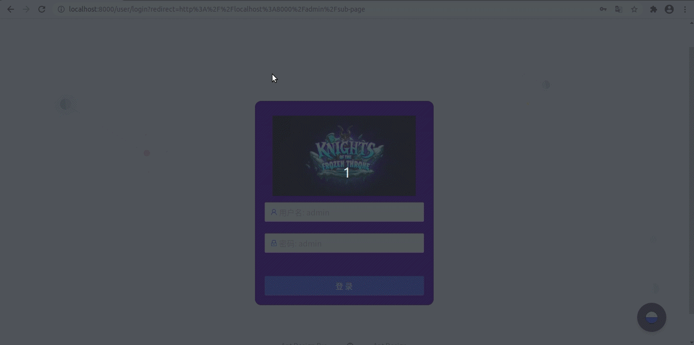

## 5. 项目代码

[github](https://github.com/ffzs/System_app_antdpro_fore-end)
[gitee](https://gitee.com/ffzs/System_app_antdpro_fore-end)
