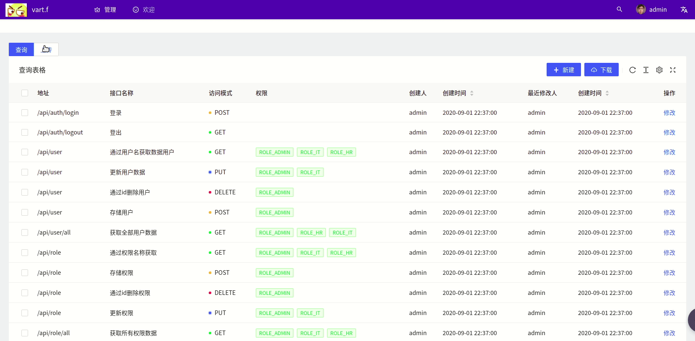
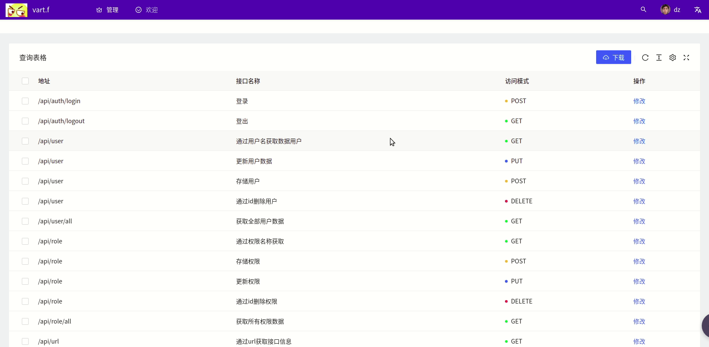

# Spring WebFlux + React搭建后台管理系统（9）:通过上传excel实现批量新增


有这样的需求，需要批量新增数据，但是一个一个的表单填写太麻烦，可以通过excel将数据汇总，然后通过上传的方式显示出来，在前端页面进行勾选，实现批量上传，需要实现一下功能：

+ 新增上传页面的切换
+ 上传的文件通过表格展示
+ 通过勾选将选定数据进行上传

## 效果展示



## 1.添加API表处理excel逻辑

+ 添加controller处理excel
+ 跟user的主体逻辑基本相同

```java
@PostMapping(value = "/upload/url/excel", consumes = MediaType.MULTIPART_FORM_DATA_VALUE)
@ResponseStatus(value = HttpStatus.OK)
@PreAuthorize("hasAnyRole('ADMIN')")
public Flux<SysApi> uploadUrl(@RequestPart("file") Flux<FilePart> filePart){

    return ioService.upload(filePart, SysApi.class)
            .cast(SysApi.class);
}
```

+ 下载excel的逻辑

```java
@PostMapping("/download/url/excel")
@PreAuthorize("hasAnyRole('ADMIN', 'IT', 'HR')")
public Mono<Void> downloadUrl(ServerHttpResponse response) {

    return sysApiService.findAll()
            .collectList()
            .flatMap(objs-> {
                try {
                    return ioService.downloadFromDb(objs, response, SysApi.class);
                } catch (UnsupportedEncodingException e) {
                    return Mono.error(new UnsupportedEncodingException());
                }
            });
}
```

### 1.1 excel处理注意点

+ 有两点发现需要注意，由于excel中数据的不可控性，trim是必要的

```java
case "java.util.List":
    value = Arrays.stream(str.substring(1, str.length() - 1).split(","))
            .map(String::trim)
            .collect(Collectors.toList());
```

+ list类型的话，如果是Nono或是blank也要给个list变量

```java
case BLANK:
case _NONE:
    if (type.getTypeName().equals("java.util.List")) value = new ArrayList<>();
    break;
```

### 1.2 下载文件内容权限区分

+ 多种权限有获取数据的需求
+ 因此需要控制不同权限获取的数据列数不同
+ 可以通过角色不同获取不同的数据
+ 也可以通过角色将部分数据写入文件
+ 这里通过角色限定head内容，再通过head内容限定获取内容

```java
public Mono<Void> downloadFromDb(List<?> objs, ServerHttpResponse response, Class<? extends DataChange> clazz) throws UnsupportedEncodingException {
    String fileName = new String(("test" + LocalDateTime.now().toLocalDate() + ".xlsx").getBytes(StandardCharsets.UTF_8), "iso8859-1");
    File file = new File(fileName);
    Set<String> banSet = Stream.of("createBy", "createTime", "lastUpdateBy", "lastUpdateTime", "roles", "password", "frozen").collect(Collectors.toSet());

    return isAdmin()
            .flatMap(isAdmin -> {
                List<String> header = Stream.of(clazz.getDeclaredFields())
                        .map(Field::getName)
                        .filter(it-> isAdmin || !banSet.contains(it))
                        .collect(Collectors.toList());
                return WriteExcelUtil.data2Workbook(objs, clazz, header);
            })
            .flatMap(workbook -> {
                try {
                    workbook.write(new FileOutputStream(file));
                } catch (IOException e) {
                    e.printStackTrace();
                }
                return downloadFile(response, file, fileName);
            });
}
```

+ 通过`ReactiveSecurityContextHolder`获取权限信息，然后判断是否为ADMIN用户

```java
private Mono<Boolean> isAdmin() {
    return ReactiveSecurityContextHolder.getContext()
            .map(it-> it.getAuthentication()
                    .getAuthorities()
                    .stream()
                    .map(GrantedAuthority::getAuthority)
                    .collect(Collectors.toSet())
            )
            .map(it -> it.contains("ROLE_ADMIN"));
}
```

+ dz用户不能下载中没有权限等信息



## 2. 前端添加api管理页面

+ 代码和user的基本相同，主要需要更换table使用的Item类
+ 上传组件

```js
          access.canAdmin && radioValue==='upload' &&(
            <Upload {...uploadProps}
            >
              <Button type="primary">
                <UploadOutlined /> 上传
              </Button>
            </Upload>
          ),
```

+ 通过一个`radio`切换查询和上传功能
+ 通过`onChange`更换value，通过hook进行数据切换

```typescript
{access.canAdmin&&(<Radio.Group
  defaultValue="read"
  buttonStyle="solid"
  onChange={(e) => {
    setRadioValue(e.target.value)
    // @ts-ignore
    actionRef.current?.reloadAndRest();
  }}
>
  <Radio.Button value="read">查询</Radio.Button>
  <Radio.Button value="upload">上传</Radio.Button>
</Radio.Group>)}
```

+ `table`通过`radio`的value更换切换数据来源

```java
request={()=>{
  if (radioValue === 'upload'){
    return getApiData();
  }
  return findAllApi();
}}
```

+ 通过upload的`onChange`将上传返回数据通过hook设置

```javascript
onChange(info:any) {
  if (info.file.status !== 'uploading') {
    // console.log(info.file, info.fileList);
  }
  if (info.file.status === 'done') {
    setApiData(info.file.response);
    // @ts-ignore
    actionRef.current?.reloadAndRest();
    message.success(`${info.file.name} file uploaded successfully`);
  } else if (info.file.status === 'error') {
    message.error(`${info.file.name} file upload failed.`);
  }
},
```

## 3. 实现批量新增

+ 通过表格的选项进行新增

```java
{access.canAdmin && radioValue === 'upload'&&(<Button
  type="primary"
  onClick={async () => {
    await handleUpdateMany(selectedRowsState);
    setSelectedRows([]);
  }}
>
  批量新增
</Button>)}
```

## 4.代码

| github | [前端（antd pro）](https://github.com/ffzs/System_app_antdpro_fore-end) | [后端（spring webflux）](https://github.com/ffzs/System_app_webflux_react) |
| ------ | ------------------------------------------------------------ | ------------------------------------------------------------ |
| gitee  | [前端（antd pro）](https://gitee.com/ffzs/System_app_antdpro_fore-end) | [后端（spring webflux）](https://gitee.com/ffzs/System_app_webflux_react) |