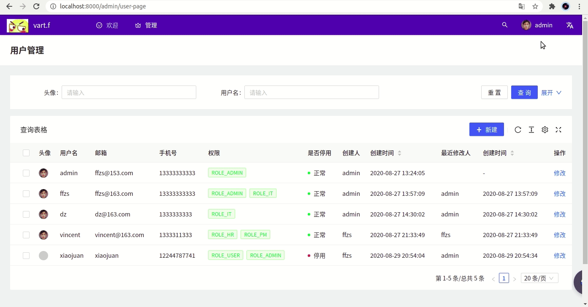
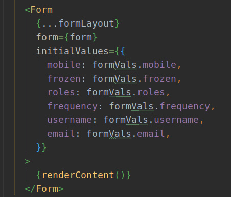
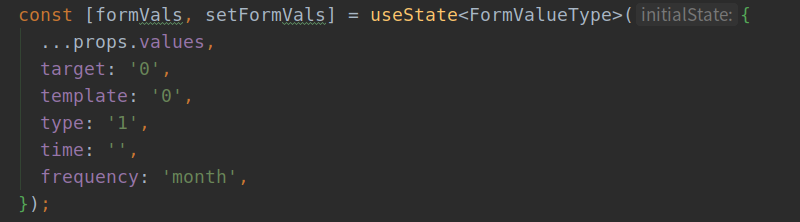
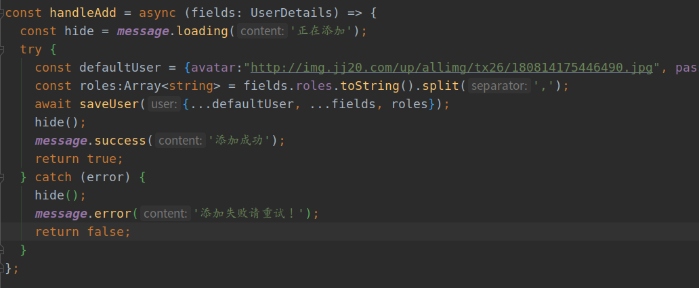

Spring WebFlux + React搭建后台管理系统（5）: antd pro v5 ProTable使用


本篇配合antdpro的 ProTable实现简单的CRUD操作：

[官方网站](https://procomponents.ant.design/components/table)

+ 更改了ProTable获取数据
+ 改写UpdateForm内容，实现新增用户
+ 更改用户信息
+ 删除用户信息
+ 修改删除需要admin权限处理

## 效果图



## 1. 设置自己的tableItem

跟据自己的数据编写Table使用的tableItem类：

```java
export interface UserDetails {
  key: number;
  username: string;
  avatar: string;
  createBy: string;
  createTime: Date;
  email: string;
  frozen: number;
  id: number;
  lastUpdateBy: string;
  lastUpdateTime: Date;
  mobile: string;
  password: string;
  roles: Array<string>;
}
```


## 2. 编写columns

+ hideInForm，`type="form"`时不显示，使用新增的使用用到
+ renderText：通过函数设置样式
+ valueEnum：用来设置枚举分类
+ option时，render的第二个元素为row内容

```java
const columns: ProColumns<UserDetails>[] = [
  {
    title: '头像',
    dataIndex: 'avatar',
    hideInForm: true,
    valueType: 'avatar',
  },
  {
    title: '用户名',
    dataIndex: 'username',
  },
  {
    title: '邮箱',
    dataIndex: 'email',
    valueType: 'textarea',
  },
  {
    title: '手机号',
    dataIndex: 'mobile',
  },
  {
    title: '权限',
    dataIndex: 'roles',
    renderText: (roles: Array<string>) => (
      <>
        {
          roles.map(role=>(
            <Tag color="green">
              {role}
            </Tag>
          ))
        }
      </>
    ),
  },
  {
    title: '是否停用',
    dataIndex: 'frozen',
    hideInForm: true,
    valueEnum: {
      0: { text: '正常', status: 'Success' },
      1: { text: '停用', status: 'Error' },
    },
  },
  {
    title: '创建人',
    dataIndex: 'createBy',
    hideInForm: true,
  },
  {
    title: '创建时间',
    dataIndex: 'createTime',
    sorter: true,
    valueType: 'dateTime',
    hideInForm: true,
  },
  {
    title: '最近修改人',
    dataIndex: 'lastUpdateBy',
    hideInForm: true,
  },
  {
    title: '创建时间',
    dataIndex: 'lastUpdateTime',
    sorter: true,
    valueType: 'dateTime',
    hideInForm: true,
  },
  {
    title: '操作',
    dataIndex: 'option',
    valueType: 'option',
    render: (_, record) => (
      <>
        <a
          onClick={() => {
            handleUpdateModalVisible(true);
            setStepFormValues(record);
          }}
        >
          修改
        </a>
      </>
    ),
  },
];
```

## 3. 处理api逻辑

访问需要携带token，这里两个坑：

+ 访问的时候需要先发送option请求，我自己写的filter需要放行option类请求
+ header里token赋值`'Authorization': Bearer ${localStorage.getItem('token')}`这样写，token后面会多出`)}`，不知道为什么，只能弄好token，然后`'Authorization': token,`这样写

配合后端编写的api配置crud的服务：

```java
export async function findAll() {
  const token = `Bearer ${localStorage.getItem('token')}`;
  return request('http://localhost:8080/api/user/all', {
    method: 'get',
    headers:{
      Accept: 'application/json',
      'Authorization': token,
    }
  })
    .then((response) => {
      const data = response.data.map((v:UserDetails) => {
        return {...v, key:v.id};
      });
      return {data};
    }).catch((error) => {
      console.log(error);
    });
}
```

## 4. updateForm组建改写

改动比较多，不一一写了，下面会放代码路径，自己看看哈，有几点需要注意：

+ 这里设置默认值



+ 这里需要传入初始的值，id，密码啥的



## 5. 修该handlers

+ 配合改好的service使用
+ 由于新增用户的roles是字符串需要改成array



## 6. 总结&遗留

1. 后端spring中filter没有放行option类请求是个坑，搞了好久，cors配置文件也要有
2. 请求在header中添加token时先把token弄好
3. 表搜索部分的逻辑还需要在修改，目前还没有弄
4. 后端分页逻辑需要弄一下
5. 前端button等根据权限改成不可触发
6. 后端update修改权限部分需要完善

## 7. 代码

github